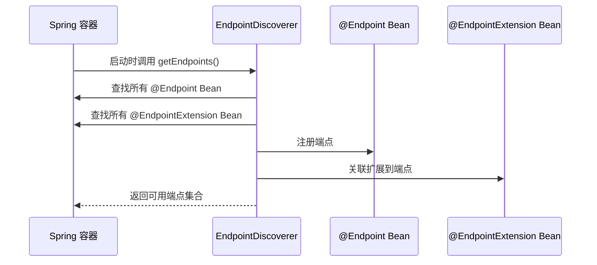

# EndpointDiscoverer 机制分析

EndpointDiscoverer 机制是 Spring Boot Actuator 用于"自动发现和注册端点（Endpoint）"的核心实现。它的主要作用和原理如下：

---

## 1. 作用

- **自动发现**：在 Spring 容器启动时，自动扫描所有被 `@Endpoint` 注解的 Bean（即端点实现类），以及被 `@EndpointExtension` 注解的扩展类。
- **注册端点**：将这些端点及其操作（如 `@ReadOperation`、`@WriteOperation` 标记的方法）注册为可暴露的管理端点。
- **支持扩展**：支持端点扩展机制（如 JMX、Web、Servlet 等不同暴露方式），并能自动关联扩展和主端点。
- **过滤与权限**：支持端点和操作的过滤（如只暴露部分端点），并处理端点的默认访问权限。

---

## 2. 核心流程

1. **扫描端点 Bean**  
   - 通过 Spring 的 BeanFactory 工具，查找所有带有 `@Endpoint` 注解的 Bean。
   - 为每个端点 Bean 创建内部描述对象（EndpointBean）。

2. **扫描扩展 Bean**  
   - 查找所有带有 `@EndpointExtension` 注解的 Bean。
   - 自动将扩展 Bean 关联到对应的主端点。

3. **端点注册与过滤**  
   - 根据配置和过滤器，决定哪些端点和操作最终会被暴露。
   - 支持自定义 EndpointFilter、OperationFilter 进行更细粒度的控制。

4. **暴露端点**  
   - 端点最终会被注册到 Web、JMX 等暴露层，由外部系统访问。

---

## 3. 入口与关键类

- **EndpointDiscoverer**（抽象类）：  
  负责上述自动发现、注册、过滤等核心逻辑。  
  其子类如 `WebEndpointDiscoverer`、`JmxEndpointDiscoverer` 分别负责 Web/JMX 端点的具体发现和注册。

- **主要方法**：
  - `getEndpoints()`：返回所有已发现并注册的端点集合。
  - `discoverEndpoints()`：实际执行端点和扩展的扫描、注册、过滤等流程。

- **相关注解**：
  - `@Endpoint`：声明一个端点类。
  - `@EndpointExtension`：声明端点扩展类。

---

## 4. 简要时序图



---

## 5. 源码关键部分

### 5.1 端点发现核心方法

```java
private Collection<EndpointBean> createEndpointBeans() {
    Map<EndpointId, EndpointBean> byId = new LinkedHashMap<>();
    String[] beanNames = BeanFactoryUtils.beanNamesForAnnotationIncludingAncestors(
        this.applicationContext, Endpoint.class);
    for (String beanName : beanNames) {
        if (!ScopedProxyUtils.isScopedTarget(beanName)) {
            EndpointBean endpointBean = createEndpointBean(beanName);
            EndpointBean previous = byId.putIfAbsent(endpointBean.getId(), endpointBean);
            Assert.state(previous == null, () -> "Found two endpoints with the id '" 
                + endpointBean.getId() + "': '" + endpointBean.getBeanName() 
                + "' and '" + previous.getBeanName() + "'");
        }
    }
    return byId.values();
}
```

### 5.2 扩展端点关联

```java
private void addExtensionBeans(Collection<EndpointBean> endpointBeans) {
    Map<EndpointId, EndpointBean> byId = endpointBeans.stream()
        .collect(Collectors.toMap(EndpointBean::getId, Function.identity()));
    String[] beanNames = BeanFactoryUtils.beanNamesForAnnotationIncludingAncestors(
        this.applicationContext, EndpointExtension.class);
    for (String beanName : beanNames) {
        ExtensionBean extensionBean = createExtensionBean(beanName);
        EndpointBean endpointBean = byId.get(extensionBean.getEndpointId());
        Assert.state(endpointBean != null, () -> ("Invalid extension '" 
            + extensionBean.getBeanName() + "': no endpoint found with id '" 
            + extensionBean.getEndpointId() + "'"));
        addExtensionBean(endpointBean, extensionBean);
    }
}
```

---

## 总结

**EndpointDiscoverer 机制让 Spring Boot Actuator 能够"无侵入、自动化"地发现、注册和暴露所有管理端点，是 Actuator 自动化和可扩展性的基础核心。**

主要特点：
- **自动化**：无需手动注册，自动扫描和发现
- **可扩展**：支持多种暴露方式（Web、JMX等）
- **可过滤**：支持端点和操作的细粒度控制
- **类型安全**：基于泛型和注解的类型安全机制

如需具体某个 Discoverer 子类（如 WebEndpointDiscoverer）的详细分析，也可以进一步说明！ 