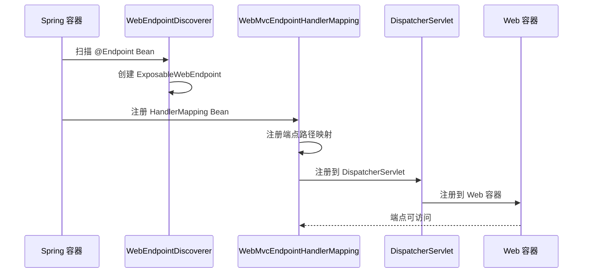

# ExposableWebEndpoint 注册到 Web 容器的机制分析

根据源码分析，下面详细说明 `ExposableWebEndpoint` 是如何注册到 web 容器中的：

---

## 1. 整体架构流程



---

## 2. 核心注册机制

### 2.1 HandlerMapping 注册

`ExposableWebEndpoint` 通过 `WebMvcEndpointHandlerMapping` 注册到 Spring MVC 中：

```java
@Bean
WebMvcEndpointHandlerMapping webEndpointHandlerMapping(Environment environment,
        WebEndpointDiscoverer endpointDiscoverer, EndpointMediaTypes endpointMediaTypes) {
    return new WebMvcEndpointHandlerMapping(
        new EndpointMapping(endpointPath),           // 端点路径映射
        endpointDiscoverer.getEndpoints(),           // 获取所有 ExposableWebEndpoint
        endpointMediaTypes,                          // 媒体类型
        corsConfiguration,                           // CORS 配置
        new EndpointLinksResolver(endpointDiscoverer.getEndpoints()), // 链接解析器
        StringUtils.hasText(endpointPath)            // 是否启用路径匹配
    );
}
```

### 2.2 端点路径映射

每个 `ExposableWebEndpoint` 都会被映射到特定的 HTTP 路径：

- **基础路径**：`/actuator`（可配置）
- **端点路径**：`/actuator/{endpointId}`
- **操作路径**：`/actuator/{endpointId}/{operation}`

例如：
- `/actuator/health` → HealthEndpoint
- `/actuator/info` → InfoEndpoint
- `/actuator/metrics` → MetricsEndpoint

---

## 3. 自动配置集成

### 3.1 WebEndpointAutoConfiguration

在 `WebEndpointAutoConfiguration` 中，`WebEndpointDiscoverer` 被注册为 Bean：

```java
@Bean
@ConditionalOnMissingBean(WebEndpointsSupplier.class)
public WebEndpointDiscoverer webEndpointDiscoverer(ParameterValueMapper parameterValueMapper,
        EndpointMediaTypes endpointMediaTypes, ObjectProvider<PathMapper> endpointPathMappers,
        ObjectProvider<AdditionalPathsMapper> additionalPathsMappers,
        ObjectProvider<OperationInvokerAdvisor> invokerAdvisors,
        ObjectProvider<EndpointFilter<ExposableWebEndpoint>> endpointFilters,
        ObjectProvider<OperationFilter<WebOperation>> operationFilters) {
    return new WebEndpointDiscoverer(this.applicationContext, parameterValueMapper, endpointMediaTypes,
            endpointPathMappers.orderedStream().toList(), additionalPathsMappers.orderedStream().toList(),
            invokerAdvisors.orderedStream().toList(), endpointFilters.orderedStream().toList(),
            operationFilters.orderedStream().toList());
}
```

### 3.2 HandlerMapping 自动注册

Spring Boot 的自动配置会检测到 `WebMvcEndpointHandlerMapping` 并将其注册到 Spring MVC 的 HandlerMapping 链中。

---

## 4. 请求处理流程

### 4.1 请求路由

当 HTTP 请求到达时：

1. **DispatcherServlet** 接收请求
2. **HandlerMapping** 链查找匹配的处理器
3. **WebMvcEndpointHandlerMapping** 匹配端点路径
4. **ExposableWebEndpoint** 处理请求
5. **WebOperation** 执行具体操作

### 4.2 路径匹配

```java
// 示例：GET /actuator/health
// 1. 匹配路径 /actuator/health
// 2. 找到 HealthEndpoint
// 3. 执行 @ReadOperation 方法
// 4. 返回健康状态
```

---

## 5. 关键组件关系

### 5.1 组件层次

```
Spring MVC
    ↓
DispatcherServlet
    ↓
HandlerMapping Chain
    ↓
WebMvcEndpointHandlerMapping
    ↓
ExposableWebEndpoint Collection
    ↓
WebOperation
```

### 5.2 核心接口

- **ExposableWebEndpoint**：Web 端点的核心接口
- **WebOperation**：Web 操作的核心接口
- **WebMvcEndpointHandlerMapping**：Spring MVC 处理器映射
- **EndpointMapping**：端点路径映射

---

## 6. 配置示例

### 6.1 基本配置

```properties
# 端点基础路径
management.endpoints.web.base-path=/actuator

# 暴露的端点
management.endpoints.web.exposure.include=health,info,metrics

# 端点路径映射
management.endpoints.web.path-mapping.health=healthcheck
```

### 6.2 自定义端点

```java
@Endpoint(id = "custom")
public class CustomEndpoint {
    
    @ReadOperation
    public Map<String, Object> info() {
        return Map.of("status", "UP");
    }
}

// 自动注册为：GET /actuator/custom
```

---

## 7. 安全与权限

### 7.1 端点过滤

通过 `EndpointFilter` 控制哪些端点被暴露：

```java
@Bean
public IncludeExcludeEndpointFilter<ExposableWebEndpoint> webExposeExcludePropertyEndpointFilter() {
    WebEndpointProperties.Exposure exposure = this.properties.getExposure();
    return new IncludeExcludeEndpointFilter<>(ExposableWebEndpoint.class, 
        exposure.getInclude(), exposure.getExclude(), 
        EndpointExposure.WEB.getDefaultIncludes());
}
```

### 7.2 访问控制

- **默认访问**：通过 `@Endpoint(defaultAccess = Access.UNRESTRICTED)` 配置
- **Spring Security**：集成 Spring Security 进行认证授权
- **CORS**：支持跨域请求配置

---

## 8. 源码分析

### 8.1 CloudFoundry 示例

从 `CloudFoundryActuatorAutoConfiguration` 可以看到完整的注册流程：

```java
@Bean
public CloudFoundryWebEndpointServletHandlerMapping cloudFoundryWebEndpointServletHandlerMapping(
        ParameterValueMapper parameterMapper, EndpointMediaTypes endpointMediaTypes,
        RestTemplateBuilder restTemplateBuilder,
        ServletEndpointsSupplier servletEndpointsSupplier,
        ControllerEndpointsSupplier controllerEndpointsSupplier,
        ApplicationContext applicationContext) {
    
    // 1. 创建端点发现器
    CloudFoundryWebEndpointDiscoverer discoverer = new CloudFoundryWebEndpointDiscoverer(
        applicationContext, parameterMapper, endpointMediaTypes, null, 
        Collections.emptyList(), Collections.emptyList(), Collections.emptyList());
    
    // 2. 获取所有端点
    Collection<ExposableWebEndpoint> webEndpoints = discoverer.getEndpoints();
    List<ExposableEndpoint<?>> allEndpoints = new ArrayList<>();
    allEndpoints.addAll(webEndpoints);
    allEndpoints.addAll(servletEndpointsSupplier.getEndpoints());
    allEndpoints.addAll(controllerEndpointsSupplier.getEndpoints());
    
    // 3. 创建 HandlerMapping
    return new CloudFoundryWebEndpointServletHandlerMapping(
        new EndpointMapping(BASE_PATH), webEndpoints, endpointMediaTypes, 
        getCorsConfiguration(), securityInterceptor, allEndpoints);
}
```

### 8.2 测试示例

从测试代码可以看到 HandlerMapping 的创建：

```java
@Bean
WebMvcEndpointHandlerMapping webEndpointHandlerMapping(Environment environment,
        WebEndpointDiscoverer endpointDiscoverer, EndpointMediaTypes endpointMediaTypes) {
    CorsConfiguration corsConfiguration = new CorsConfiguration();
    corsConfiguration.setAllowedOrigins(Arrays.asList("https://example.com"));
    corsConfiguration.setAllowedMethods(Arrays.asList("GET", "POST"));
    String endpointPath = environment.getProperty("endpointPath");
    return new WebMvcEndpointHandlerMapping(new EndpointMapping(endpointPath),
            endpointDiscoverer.getEndpoints(), endpointMediaTypes, corsConfiguration,
            new EndpointLinksResolver(endpointDiscoverer.getEndpoints()), 
            StringUtils.hasText(endpointPath));
}
```

---

## 9. 扩展机制

### 9.1 端点扩展

支持通过 `@EndpointWebExtension` 扩展端点功能：

```java
@EndpointWebExtension(endpoint = HealthEndpoint.class)
public class HealthEndpointWebExtension {
    
    @ReadOperation
    public Health getHealth() {
        // 扩展健康检查逻辑
        return Health.up().withDetail("custom", "value").build();
    }
}
```

### 9.2 自定义 HandlerMapping

可以创建自定义的 HandlerMapping 来处理特殊的端点需求：

```java
@Bean
public CustomEndpointHandlerMapping customEndpointHandlerMapping(
        WebEndpointsSupplier webEndpointsSupplier) {
    return new CustomEndpointHandlerMapping(webEndpointsSupplier.getEndpoints());
}
```

---

## 10. 性能优化

### 10.1 缓存机制

- **端点缓存**：端点发现结果会被缓存，避免重复扫描
- **操作缓存**：支持操作级别的缓存（如 `@ReadOperation` 的 TTL 缓存）

### 10.2 懒加载

- **端点懒加载**：端点只在首次访问时初始化
- **操作懒加载**：操作参数和返回值类型在运行时解析

---

## 总结

`ExposableWebEndpoint` 注册到 web 容器的核心机制是：

1. **自动发现**：`WebEndpointDiscoverer` 扫描并创建 `ExposableWebEndpoint`
2. **HandlerMapping 注册**：`WebMvcEndpointHandlerMapping` 将端点注册到 Spring MVC
3. **路径映射**：将端点 ID 映射为 HTTP 路径
4. **请求处理**：通过 Spring MVC 的请求处理链处理端点请求
5. **自动配置**：Spring Boot 自动配置确保所有组件正确注册

**核心价值**：
- **零配置**：开发者只需要添加 `@Endpoint` 注解
- **自动化**：端点自动注册到 web 容器
- **标准化**：统一的端点暴露机制
- **可扩展**：支持自定义和扩展
- **类型安全**：编译时类型检查

这种机制实现了端点的"零配置"暴露，开发者只需要添加 `@Endpoint` 注解，端点就会自动注册到 web 容器中并可通过 HTTP 访问。 