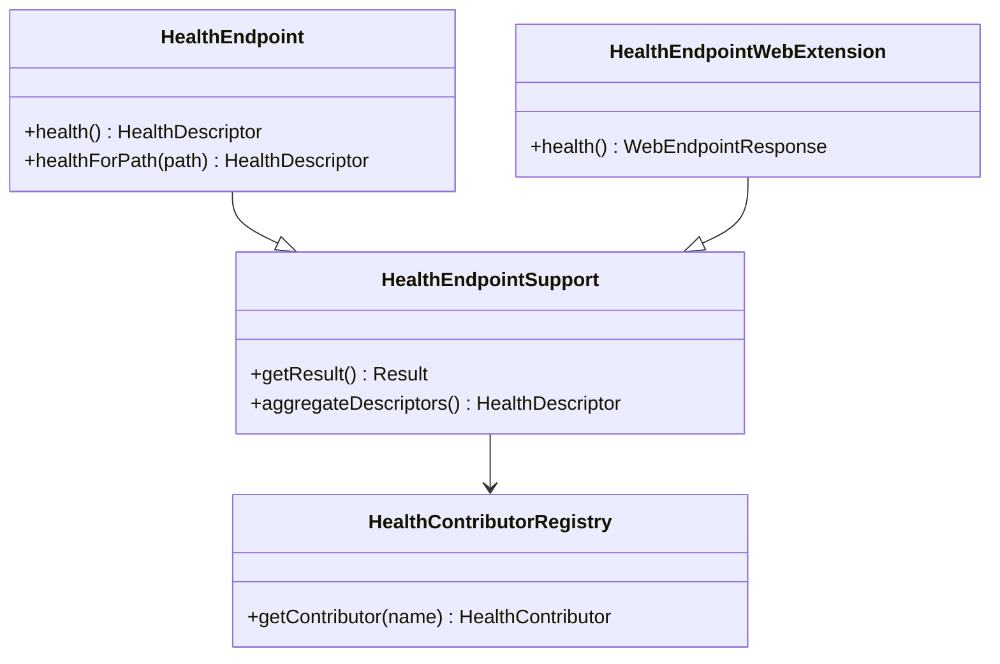

# HealthEndpoint 详细说明

根据源码分析，下面详细说明 `HealthEndpoint` 的实现机制和功能：

---

## 1. 核心架构



---

## 2. 核心功能

### 2.1 健康检查端点

`HealthEndpoint` 是 Spring Boot Actuator 中最重要的端点之一，用于检查应用程序的健康状态：

```java
@Endpoint(id = "health")
public class HealthEndpoint extends HealthEndpointSupport<Health, HealthDescriptor> {
    
    @ReadOperation
    public HealthDescriptor health() {
        HealthDescriptor health = health(ApiVersion.V3, EMPTY_PATH);
        return (health != null) ? health : IndicatedHealthDescriptor.UP;
    }
    
    @ReadOperation
    public HealthDescriptor healthForPath(@Selector(match = Match.ALL_REMAINING) String... path) {
        return health(ApiVersion.V3, path);
    }
}
```

### 2.2 支持的操作

- **GET `/actuator/health`**：获取整体健康状态
- **GET `/actuator/health/{component}`**：获取特定组件的健康状态
- **GET `/actuator/health/{group}`**：获取健康组的健康状态

---

## 3. 健康状态类型

### 3.1 状态枚举

```java
public enum Status {
    UP,        // 健康
    DOWN,      // 不健康
    OUT_OF_SERVICE,  // 停止服务
    UNKNOWN    // 未知状态
}
```

### 3.2 健康描述符

```java
public interface HealthDescriptor {
    Status getStatus();           // 健康状态
    Map<String, Object> getDetails();  // 详细信息
}
```

---

## 4. 健康检查组件

### 4.1 内置健康检查器

Spring Boot 提供多种内置的健康检查器：

- **DatabaseHealthIndicator**：数据库连接健康检查
- **DiskSpaceHealthIndicator**：磁盘空间健康检查
- **RedisHealthIndicator**：Redis 连接健康检查
- **MongoHealthIndicator**：MongoDB 连接健康检查
- **RabbitHealthIndicator**：RabbitMQ 连接健康检查
- **ElasticsearchHealthIndicator**：Elasticsearch 连接健康检查

### 4.2 自定义健康检查器

```java
@Component
public class CustomHealthIndicator implements HealthIndicator {
    
    @Override
    public Health health() {
        try {
            // 执行健康检查逻辑
            if (isHealthy()) {
                return Health.up()
                    .withDetail("message", "Service is healthy")
                    .withDetail("timestamp", System.currentTimeMillis())
                    .build();
            } else {
                return Health.down()
                    .withDetail("message", "Service is unhealthy")
                    .withDetail("error", "Connection failed")
                    .build();
            }
        } catch (Exception e) {
            return Health.down()
                .withDetail("message", "Health check failed")
                .withDetail("error", e.getMessage())
                .build();
        }
    }
}
```

---

## 5. 健康端点组

### 5.1 组配置

支持将健康检查器分组，便于管理和访问：

```properties
# 健康端点组配置
management.endpoint.health.group.readiness.include=db,redis
management.endpoint.health.group.liveness.include=ping
management.endpoint.health.group.readiness.additional-properties.include=readinessState
management.endpoint.health.group.liveness.additional-properties.include=livenessState
```

### 5.2 访问路径

- **就绪检查**：`GET /actuator/health/readiness`
- **存活检查**：`GET /actuator/health/liveness`

---

## 6. 响应格式

### 6.1 基本响应

```json
{
  "status": "UP",
  "components": {
    "db": {
      "status": "UP",
      "details": {
        "database": "H2",
        "validationQuery": "isValid()"
      }
    },
    "diskSpace": {
      "status": "UP",
      "details": {
        "total": 499963174912,
        "free": 419430400000,
        "threshold": 10485760
      }
    }
  }
}
```

### 6.2 详细响应

```json
{
  "status": "UP",
  "components": {
    "db": {
      "status": "UP",
      "details": {
        "database": "H2",
        "validationQuery": "isValid()"
      }
    },
    "diskSpace": {
      "status": "UP",
      "details": {
        "total": 499963174912,
        "free": 419430400000,
        "threshold": 10485760
      }
    },
    "ping": {
      "status": "UP"
    }
  }
}
```

---

## 7. 配置选项

### 7.1 基本配置

```properties
# 启用健康端点
management.endpoint.health.enabled=true

# 健康端点路径
management.endpoint.health.base-path=/actuator/health

# 显示详细信息
management.endpoint.health.show-details=when-authorized

# 显示组件
management.endpoint.health.show-components=when-authorized

# 慢健康检查器日志阈值
management.endpoint.health.logging.slow-indicator-threshold=5s
```

### 7.2 状态映射

```properties
# HTTP 状态码映射
management.endpoint.health.status.http-mapping.down=503
management.endpoint.health.status.http-mapping.out-of-service=503
management.endpoint.health.status.http-mapping.unknown=200
```

---

## 8. 安全控制

### 8.1 访问控制

```java
@Configuration
public class HealthSecurityConfig {
    
    @Bean
    public SecurityFilterChain healthSecurityFilterChain(HttpSecurity http) throws Exception {
        http.authorizeHttpRequests(authorize -> authorize
            .requestMatchers("/actuator/health").permitAll()
            .requestMatchers("/actuator/health/**").hasRole("ACTUATOR")
            .anyRequest().authenticated()
        );
        return http.build();
    }
}
```

### 8.2 敏感信息保护

- **默认行为**：健康端点不显示敏感信息
- **授权访问**：只有授权用户才能看到详细信息
- **自定义控制**：可通过配置控制信息显示

---

## 9. 性能优化

### 9.1 缓存机制

```java
@Component
public class CachedHealthIndicator implements HealthIndicator {
    
    private final HealthIndicator delegate;
    private final Cache<Health> cache;
    
    public CachedHealthIndicator(HealthIndicator delegate) {
        this.delegate = delegate;
        this.cache = Caffeine.newBuilder()
            .expireAfterWrite(30, TimeUnit.SECONDS)
            .build();
    }
    
    @Override
    public Health health() {
        return cache.get("health", k -> delegate.health());
    }
}
```

### 9.2 异步健康检查

```java
@Component
public class AsyncHealthIndicator implements HealthIndicator {
    
    private final CompletableFuture<Health> healthFuture;
    
    public AsyncHealthIndicator() {
        this.healthFuture = CompletableFuture.supplyAsync(() -> {
            // 异步执行健康检查
            return performHealthCheck();
        });
    }
    
    @Override
    public Health health() {
        try {
            return healthFuture.get(5, TimeUnit.SECONDS);
        } catch (Exception e) {
            return Health.down().withDetail("error", e.getMessage()).build();
        }
    }
}
```

---

## 10. 监控集成

### 10.1 Prometheus 集成

```yaml
# prometheus.yml
scrape_configs:
  - job_name: 'spring-boot-app'
    metrics_path: '/actuator/prometheus'
    static_configs:
      - targets: ['localhost:8080']
```

### 10.2 Kubernetes 集成

```yaml
# deployment.yaml
apiVersion: apps/v1
kind: Deployment
metadata:
  name: spring-boot-app
spec:
  template:
    spec:
      containers:
      - name: app
        livenessProbe:
          httpGet:
            path: /actuator/health/liveness
            port: 8080
          initialDelaySeconds: 60
          periodSeconds: 10
        readinessProbe:
          httpGet:
            path: /actuator/health/readiness
            port: 8080
          initialDelaySeconds: 30
          periodSeconds: 10
```

---

## 11. 源码分析

### 11.1 核心类结构

```java
// HealthEndpoint 继承自 HealthEndpointSupport
public class HealthEndpoint extends HealthEndpointSupport<Health, HealthDescriptor> {
    
    // 支持两种操作
    @ReadOperation
    public HealthDescriptor health() { ... }
    
    @ReadOperation
    public HealthDescriptor healthForPath(@Selector(match = Match.ALL_REMAINING) String... path) { ... }
}
```

### 11.2 Web 扩展

```java
@EndpointWebExtension(endpoint = HealthEndpoint.class)
public class HealthEndpointWebExtension extends HealthEndpointSupport<Health, HealthDescriptor> {
    
    @ReadOperation
    public WebEndpointResponse<HealthDescriptor> health(ApiVersion apiVersion, 
            WebServerNamespace serverNamespace, SecurityContext securityContext) { ... }
}
```

### 11.3 自动配置

```java
@Configuration(proxyBeanMethods = false)
class HealthEndpointConfiguration {
    
    @Bean
    @ConditionalOnMissingBean
    HealthEndpoint healthEndpoint(HealthContributorRegistry halthContributorRegistry,
            ObjectProvider<ReactiveHealthContributorRegistry> reactiveHealthContributorRegistry,
            HealthEndpointGroups groups, HealthEndpointProperties properties) {
        return new HealthEndpoint(halthContributorRegistry, 
            reactiveHealthContributorRegistry.getIfAvailable(), groups,
            properties.getLogging().getSlowIndicatorThreshold());
    }
}
```

---

## 12. 使用场景

### 12.1 容器健康检查

```dockerfile
# Dockerfile
HEALTHCHECK --interval=30s --timeout=3s --start-period=5s --retries=3 \
  CMD curl -f http://localhost:8080/actuator/health || exit 1
```

### 12.2 负载均衡器健康检查

```nginx
# nginx.conf
upstream backend {
    server 192.168.1.10:8080 max_fails=3 fail_timeout=30s;
    server 192.168.1.11:8080 max_fails=3 fail_timeout=30s;
}

server {
    location /health {
        proxy_pass http://backend/actuator/health;
        access_log off;
    }
}
```

### 12.3 监控系统集成

```yaml
# Grafana Dashboard
panels:
  - title: "Application Health"
    type: "stat"
    targets:
      - expr: 'up{job="spring-boot-app"}'
        legendFormat: "{{instance}}"
```

---

## 总结

`HealthEndpoint` 是 Spring Boot Actuator 的核心组件，提供：

1. **全面的健康检查**：支持多种内置和自定义健康检查器
2. **灵活的分组机制**：支持健康检查器分组管理
3. **丰富的配置选项**：可配置显示级别、状态映射等
4. **安全控制**：支持访问控制和敏感信息保护
5. **性能优化**：支持缓存和异步健康检查
6. **监控集成**：与 Prometheus、Kubernetes 等监控系统集成

**核心价值**：
- **运维友好**：为容器编排、负载均衡提供健康状态
- **监控集成**：与各种监控系统无缝集成
- **可扩展性**：支持自定义健康检查器
- **安全性**：保护敏感信息，支持访问控制
- **性能优化**：支持缓存和异步检查

它是应用程序监控和运维的重要基础设施，为容器编排、负载均衡、监控告警等提供健康状态信息。 