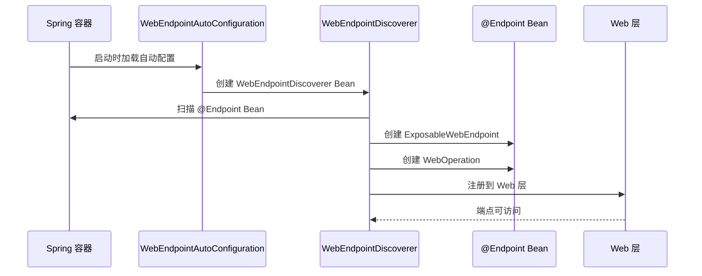

# WebEndpointDiscoverer 详细分析

根据源码分析，下面详细分析 `WebEndpointDiscoverer` 的实现机制：

---

## 1. 类定义与继承关系

```java
public class WebEndpointDiscoverer extends EndpointDiscoverer<ExposableWebEndpoint, WebOperation>
        implements WebEndpointsSupplier
```

- **继承自**：`EndpointDiscoverer<ExposableWebEndpoint, WebOperation>`
- **实现接口**：`WebEndpointsSupplier`
- **泛型参数**：
  - `E = ExposableWebEndpoint`：Web 端点的具体类型
  - `O = WebOperation`：Web 操作的具体类型

---

## 2. 核心成员变量

```java
private final List<PathMapper> endpointPathMappers;           // 端点路径映射器
private final List<AdditionalPathsMapper> additionalPathsMappers;  // 额外路径映射器
private final RequestPredicateFactory requestPredicateFactory;     // 请求谓词工厂
```

---

## 3. 构造函数与依赖注入

```java
public WebEndpointDiscoverer(ApplicationContext applicationContext, 
                           ParameterValueMapper parameterValueMapper,
                           EndpointMediaTypes endpointMediaTypes, 
                           List<PathMapper> endpointPathMappers,
                           List<AdditionalPathsMapper> additionalPathsMappers, 
                           Collection<OperationInvokerAdvisor> invokerAdvisors,
                           Collection<EndpointFilter<ExposableWebEndpoint>> endpointFilters,
                           Collection<OperationFilter<WebOperation>> operationFilters)
```

**关键依赖**：
- `EndpointMediaTypes`：定义端点支持的媒体类型
- `PathMapper`：将端点 ID 映射为 HTTP 路径
- `AdditionalPathsMapper`：为端点提供额外的路径映射
- `RequestPredicateFactory`：创建 HTTP 请求谓词

---

## 4. 核心方法实现

### 4.1 创建 Web 端点

```java
@Override
protected ExposableWebEndpoint createEndpoint(Object endpointBean, EndpointId id, 
                                             Access defaultAccess, Collection<WebOperation> operations) {
    String rootPath = PathMapper.getRootPath(this.endpointPathMappers, id);
    return new DiscoveredWebEndpoint(this, endpointBean, id, rootPath, defaultAccess, 
                                   operations, this.additionalPathsMappers);
}
```

**作用**：
- 获取端点的根路径（如 `/actuator/health`）
- 创建 `DiscoveredWebEndpoint` 实例

### 4.2 创建 Web 操作

```java
@Override
protected WebOperation createOperation(EndpointId endpointId, 
                                     DiscoveredOperationMethod operationMethod,
                                     OperationInvoker invoker) {
    String rootPath = PathMapper.getRootPath(this.endpointPathMappers, endpointId);
    WebOperationRequestPredicate requestPredicate = this.requestPredicateFactory
        .getRequestPredicate(rootPath, operationMethod);
    return new DiscoveredWebOperation(endpointId, operationMethod, invoker, requestPredicate);
}
```

**作用**：
- 为每个操作创建 HTTP 请求谓词（包含路径、HTTP 方法、媒体类型等）
- 创建 `DiscoveredWebOperation` 实例

### 4.3 创建操作键

```java
@Override
protected OperationKey createOperationKey(WebOperation operation) {
    return new OperationKey(operation.getRequestPredicate(),
        () -> "web request predicate " + operation.getRequestPredicate());
}
```

**作用**：为操作创建唯一标识，用于去重和冲突检测。

---

## 5. 自动配置集成

在 `WebEndpointAutoConfiguration` 中注册：

```java
@Bean
@ConditionalOnMissingBean(WebEndpointsSupplier.class)
public WebEndpointDiscoverer webEndpointDiscoverer(ParameterValueMapper parameterValueMapper,
        EndpointMediaTypes endpointMediaTypes, ObjectProvider<PathMapper> endpointPathMappers,
        ObjectProvider<AdditionalPathsMapper> additionalPathsMappers,
        ObjectProvider<OperationInvokerAdvisor> invokerAdvisors,
        ObjectProvider<EndpointFilter<ExposableWebEndpoint>> endpointFilters,
        ObjectProvider<OperationFilter<WebOperation>> operationFilters) {
    return new WebEndpointDiscoverer(this.applicationContext, parameterValueMapper, endpointMediaTypes,
            endpointPathMappers.orderedStream().toList(), additionalPathsMappers.orderedStream().toList(),
            invokerAdvisors.orderedStream().toList(), endpointFilters.orderedStream().toList(),
            operationFilters.orderedStream().toList());
}
```

---

## 6. 工作流程



---

## 7. 关键特性

### 7.1 路径映射
- 支持自定义端点路径映射
- 支持额外路径映射（如健康检查的 `/health` 和 `/actuator/health`）

### 7.2 媒体类型处理
- 自动推断操作的媒体类型
- 支持自定义媒体类型声明

### 7.3 请求谓词生成
- 根据操作注解自动生成 HTTP 请求谓词
- 包含路径、方法、媒体类型等信息

### 7.4 扩展支持
- 支持 `@EndpointWebExtension` 扩展端点
- 自动关联扩展和主端点

---

## 8. 使用示例

```java
@Endpoint(id = "custom")
public class CustomEndpoint {
    
    @ReadOperation
    public Map<String, Object> info() {
        return Map.of("status", "UP");
    }
    
    @WriteOperation
    public void update(String value) {
        // 更新逻辑
    }
}
```

**生成的 Web 端点**：
- 路径：`/actuator/custom`
- GET 操作：`GET /actuator/custom` → `info()`
- POST 操作：`POST /actuator/custom` → `update()`

---

## 9. 测试用例分析

从测试类可以看出 WebEndpointDiscoverer 的主要功能：

### 9.1 基本功能测试
- 无端点 Bean 时返回空集合
- 正确发现和注册 Web 端点
- 支持端点扩展机制

### 9.2 错误处理测试
- 扩展端点缺少主端点时抛出异常
- 重复端点 ID 时抛出异常
- 重复操作时抛出异常

### 9.3 高级功能测试
- 支持缓存操作（CachingOperationInvoker）
- 支持资源类型返回（application/octet-stream）
- 支持自定义媒体类型

---

## 10. 与其他组件的关系

### 10.1 继承关系
```
EndpointDiscoverer<E, O>
    ↓
WebEndpointDiscoverer<ExposableWebEndpoint, WebOperation>
```

### 10.2 相关组件
- `JmxEndpointDiscoverer`：JMX 端点发现器
- `ServletEndpointDiscoverer`：Servlet 端点发现器
- `ControllerEndpointDiscoverer`：Controller 端点发现器

### 10.3 自动配置
- `WebEndpointAutoConfiguration`：Web 端点自动配置
- `EndpointAutoConfiguration`：端点基础自动配置

---

## 总结

`WebEndpointDiscoverer` 是 Spring Boot Actuator 中专门负责 Web 端点发现和注册的核心组件，它：

1. **继承通用发现器**：复用 `EndpointDiscoverer` 的基础发现逻辑
2. **Web 特定处理**：添加路径映射、请求谓词生成等 Web 特有功能
3. **自动配置集成**：通过 `WebEndpointAutoConfiguration` 自动注册
4. **扩展性强**：支持自定义路径映射、媒体类型、过滤器等
5. **类型安全**：基于泛型确保类型安全

它是连接 `@Endpoint` 注解和 HTTP 暴露层的桥梁，让开发者能够通过简单的注解就能创建可访问的 Web 管理端点。

**核心价值**：
- 自动化：无需手动注册，自动扫描和发现
- 标准化：统一的端点暴露机制
- 可扩展：支持多种自定义和扩展方式
- 类型安全：编译时类型检查 