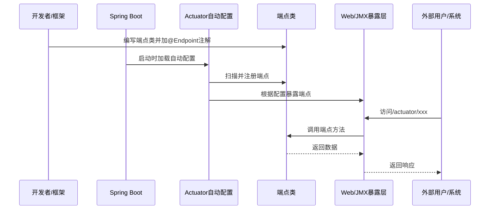

# Spring Boot Actuator 模块核心流程与入口分析

---

## 1. 核心流程分析

### 1.1 端点声明与实现
- 开发者或框架通过 `@Endpoint` 注解声明一个端点类（如 `InfoEndpoint`）。
- 端点类中的方法通过 `@ReadOperation`、`@WriteOperation`、`@DeleteOperation` 注解，标记为可暴露的操作。

### 1.2 自动配置与端点发现
- actuator 的自动配置（主要在 `spring-boot-actuator-autoconfigure` 模块）会扫描所有被 `@Endpoint` 注解的类。
- 通过 `EndpointDiscoverer` 机制，将端点注册到 Spring 容器中。

### 1.3 端点暴露
- 自动配置会根据配置（如 `management.endpoints.web.exposure.include`）决定哪些端点通过 HTTP、JMX 等方式暴露。
- 对于 Web 端点，会注册到 `/actuator/*` 路径下，由 Spring MVC/WebFlux 统一调度。
- JMX 端点则注册到 JMX MBeanServer。

### 1.4 安全与权限控制
- 自动配置会根据安全配置（如 Spring Security）决定端点的访问权限。
- 敏感端点默认关闭或仅限认证用户访问。

### 1.5 外部访问
- 运维、监控系统或开发者通过 HTTP/JMX 等协议访问端点，获取应用健康、指标、配置信息等。

---

## 2. 入口文件分析

### 2.1 端点声明入口
- 典型端点类如：  
  `org.springframework.boot.actuate.info.InfoEndpoint`  
  `org.springframework.boot.actuate.health.HealthEndpoint`  
  这些类都用 `@Endpoint` 注解声明，是端点的“入口”。

### 2.2 自动配置入口
- 自动配置类主要在 `spring-boot-actuator-autoconfigure` 模块，如：  
  `org.springframework.boot.actuate.autoconfigure.endpoint.web.WebEndpointAutoConfiguration`  
  `org.springframework.boot.actuate.autoconfigure.endpoint.EndpointAutoConfiguration`  
  这些类负责端点的发现、注册和暴露。

### 2.3 注解入口
- `org.springframework.boot.actuate.endpoint.annotation.Endpoint`  
  这是所有端点的声明注解，是端点机制的“根入口”。

### 2.4 端点发现与注册入口
- `org.springframework.boot.actuate.endpoint.annotation.EndpointDiscoverer`  
  负责扫描、发现并注册所有端点。

---

## 3. 典型流程时序图

---

## 总结

- **核心流程**：端点声明 → 自动配置发现 → 注册暴露 → 安全控制 → 外部访问
- **主要入口**：
  - 端点注解与实现类（如 `InfoEndpoint`）
  - 自动配置类（如 `WebEndpointAutoConfiguration`）
  - 端点发现器（`EndpointDiscoverer`）

如需具体某个端点或自动配置类的详细源码分析，可以进一步指定！ 